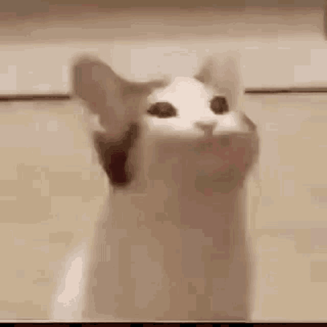

# Clase-01

## Apuntes de la clase.
Hablamos sobre el libro que nos mandaron a leer y entramos mas en contaxto para entender el ramo.

## [x] Tarea 2 Objetos y 10 Cualidades por cada objeto

## $${\color{purple}Computador}$$ 
- Colores
- Piezas
- Vidrio
- Cables
- Ventiladores
- Pesada
- Entradas
- Caro
- Discos
- Energia
- Mediano

## $${\color{purple}Celular}$$ 
- Negro
- Fragil
- Camara
- Circuito
- Funda
- Botones
- Almacenamiento de energia
- Reproductor
- Grabadora
- Conexion social
- Costoso

## [x] Hablar y observar las obras de Mateo Cereda y Gabriela Inostroza

### $${\color{green}Mateo}$$

Donante Universal: Logro entender a lo que va la obra en donde usa la sangre como concepto por su titulo.
En donde el "paciente" universal es quien alimenta a todos pero si mal no me equivoco es el unico que no recibe de todos.
Lo que es algo contradictorio la verdad ya que es el unico que le da a todos como dice su nombre.

### $${\color{pink}Gabriela}$$

Aunque al principio me costo entenderlo la verdad, me gusto mucho el uso del sonido al cargar el poema que enseñaba en el lcd. 
No logro ver la metafora o la vision pero si me gusto y ver el vidrio con el diseño de saltamontes fue una buena decoracion para mi.

## Aprendimos a poner imagenes y gif.

## $${\color{red}Muejeje}$$    

 

## $${\color{red}Blablabla}$$

