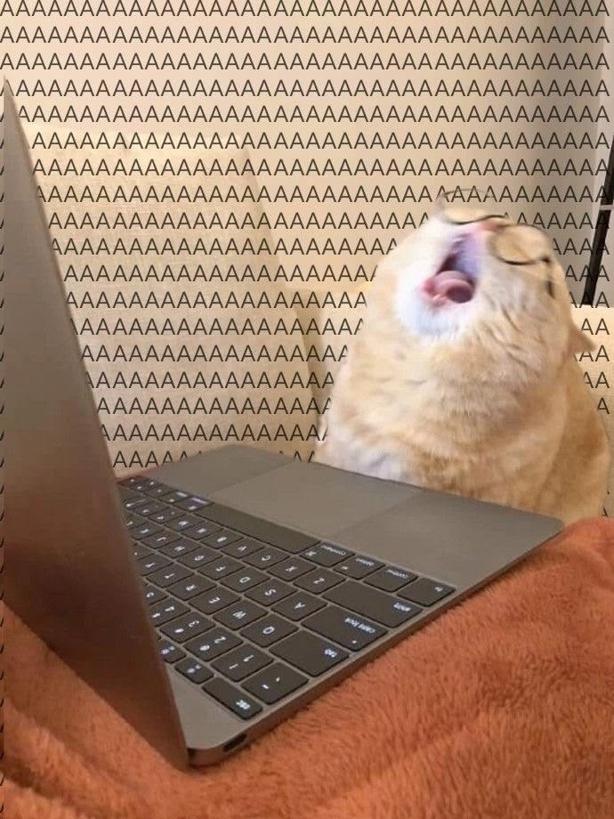

# Charla de curso sobre lo que pasara a futuro y lo lento que vamos

### Repasaremos todas las clases anteriores pasadas para poder ordenar los github y sepan mas sobre la plataforma

### Aprendimos como entrar mas rapido al modo editor para ordenar mejor en github.

## Repaso de clase (Clases que vimos cuando nos dijeron leer unos textos) 

- Curso objeto como caja de herramientas

#### Que es un objeto?

Todo aquel que se puede relacionar y tiene esencia.

### Mesa cientifica
- Aquella en donde se enfoca en la creacion del objeto
### Mesa humanista
- Aquella donde su relacion con el entorno es el objeto
### 3ra mesa
- Aquella en donde se relaciona ambas mesas para crear una 3ra en donde lo mas cercano son las artes y la filosofia.

- Objeto = No tienen encencia, sus cualidades son accidentes.

#### Operacion reflexiva = METÁFORA
- Lo que permite estar entre ambas mesas Cientifica y humanista.
- Conbinar cualidades no esenciales
- DISÍMIL (Palabra clave)

#### Ejemplo Gabriela Perez: Caminar es un objeto
- Caminar (Accion)
- Dinamico 
- Especifico 
- Datos (Latitud, Longitud y Tiempo)
