 ## Hoy fue dia de salida

#### Apuntes

Hoy nos juntamos con las chicas de HambreHambreHambre y nos dieron una introduccion sobre lo que hacen y la colaboracion con el museo de violeta parra. Nos contaron su historia desde que año partieron que fue el 2019, las colaboraciones que han tenido durante los años, la historia de los fanzines y los talleres. 
Los fanzines que nos enseñaron estan hechos con impresiones en color negro por la impresora que tienen. Aparte de eso tambien tienen varios tamaños, colores, tipografia y formas. 
Segun nos contaban pueden ser de algo en especifico que queramos como poemas o cuentos, o hacerlo de lo que nosotros queramos como dibujos o una palabra repetida mil veces. Tambien pueden ser formados por 1 hoja o 10 hojas por ejemplo.

Luego de ese tiempo pasamos a ver el museo de violeta parra...

### Museo Violeta Parra

Al entrar al museo de violeta parra nos comenzaron hablar sobre violeta parra, contarnos de ella y enseñarnos una fotografia en la que estaba con su hijo angel. Luego nos enseñaron y contaron sobre el Guitarron, y cuantas canciones tenia violeta parra que fueron 3000. 
Luego pasamos a la siguiente sala donde nos dieron la guia contandonos la historia de las siguientes fotos.

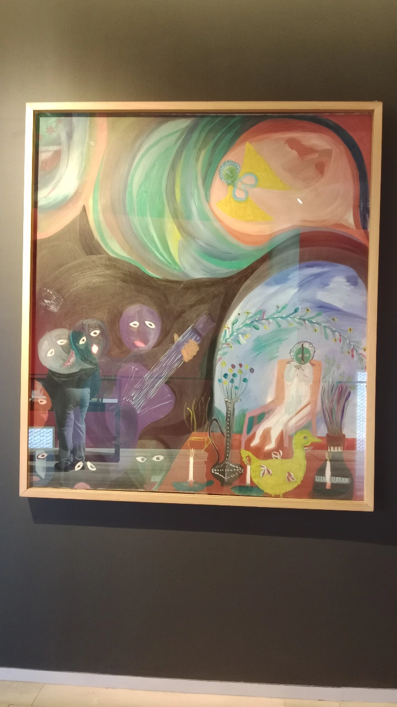

- Poema y pintura (Rin del angelito). Donde nos contaron el porque el nombre de angelito, sobre lo que se hacia a los niños y sobre la pintura mencionada.

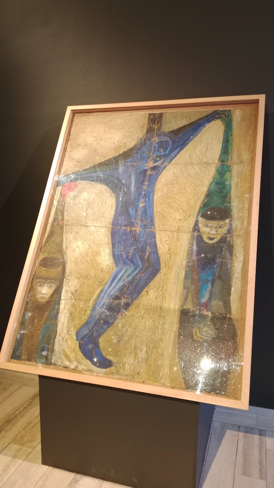

- Nos contaron la historia y descripcion de la pintura (Justice)
asi como tambien teorias de la fecha en la que se hizo la pinturo y sus detalles del guardado donde estaba tan deteorada.

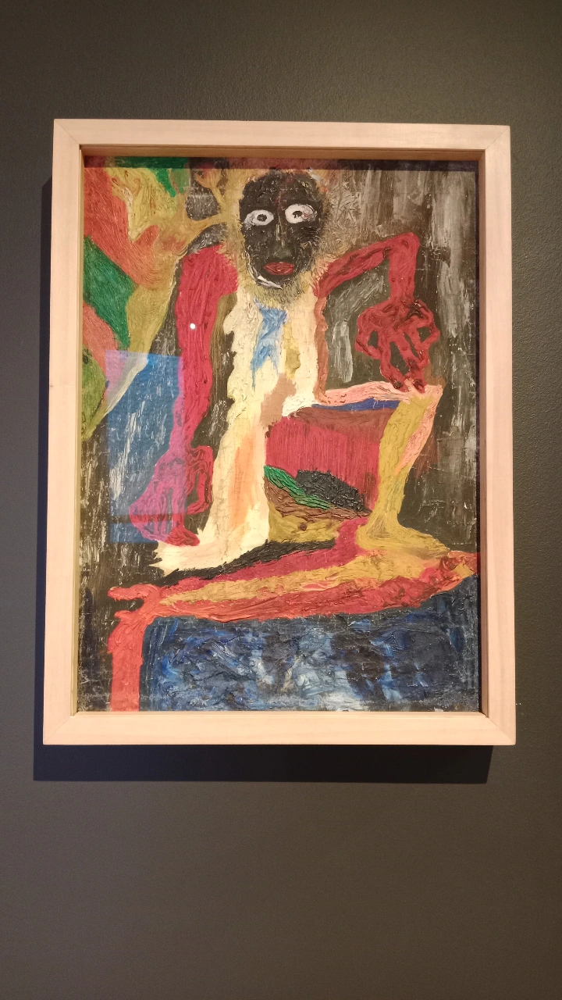

- Siguiendo con las pinturas nos conto sobre el mito de chiloe donde fue echa la pintura y de quien se supone estaba retratada. La pintura no se sabe si fue echa por violeta parra ya que sigue en investigacion.

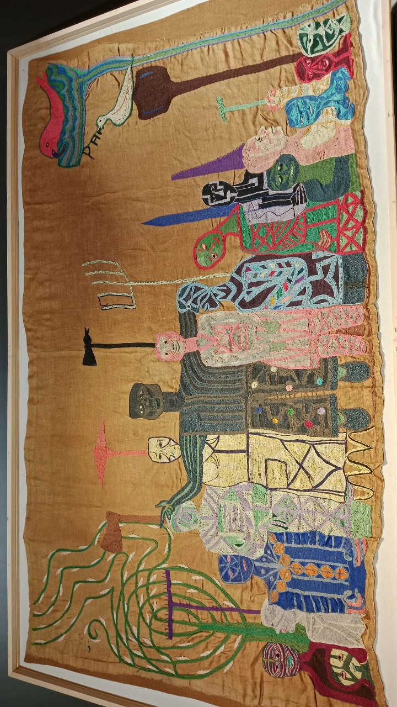

- Nos contaron la historia de la tejido (La huelga de los campesinos) donde nos enseñan los detalles y quienes pudieron ser los que se retrato en el tejido a si como su gran tamaño y detalles por dentro. 

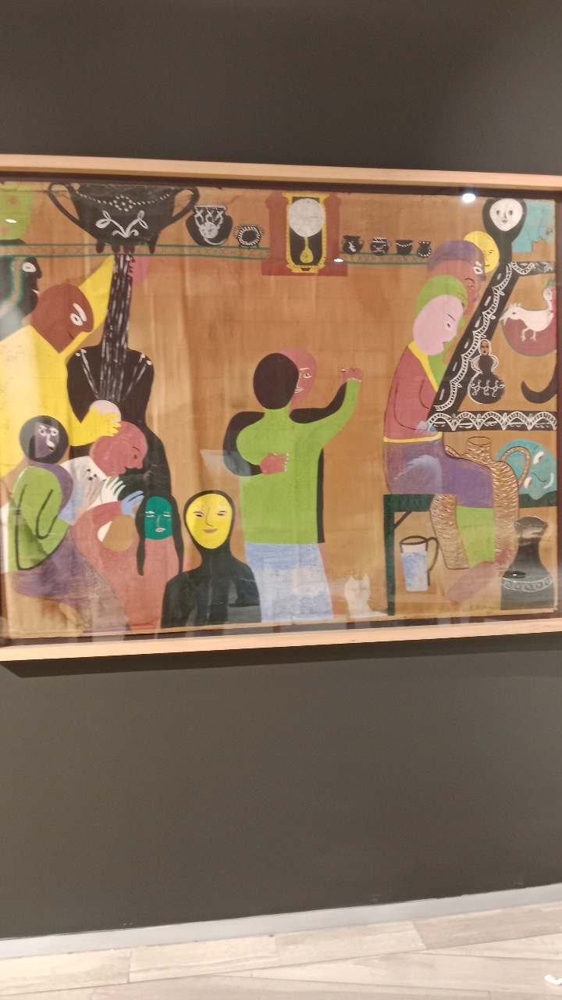

- Nos contaron la historia y descripcion de la pintura (sin titulo)
asi como tambien el material y la historia de la pintura. Tambien nos mencionaron el termino antiguo que se usaba para decir "Carretes o fiestas".

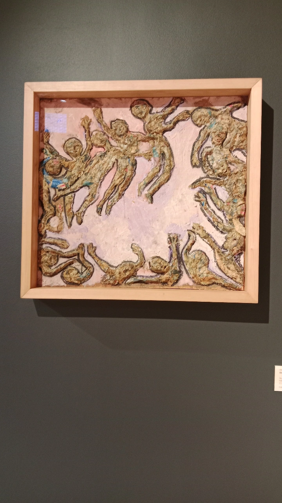

- Nos contaron la historia y descripcion de la pintura (sin titulo)
asi como tambien el material y la historia. 

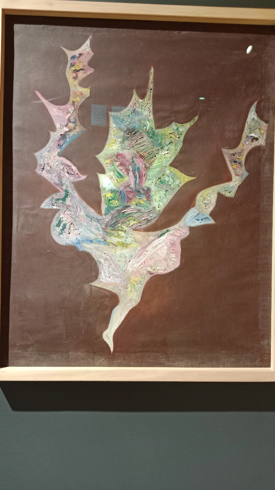

- Sobre esta pintura tambien nos contaron pero en particular la puse porque me llamo la atencion lo abstracta que es, como uso los colores y la tecnica del pinceleado con oleo. como el fondo que parece ser negro aunque no es asi, tenia un tono de vino al mirar de cerca. daba mas potencial a los colores y la forma de la pintura. Que a lo personal senti que pinto un pajaro en caidaa que aunque no se nota mucho en la imagen en la parte de abajo que es la cabeza para mi, tenia una linea como si fuera el ojo del ave.

## Encargo 

### - Plantear la definicion del fanzine 
### - Que espacio del fanzine nos interesa (Fuera del papel)
### - Trabajar en conjunto con otra persona

#### Definicion: Un Fanzine es una forma y/o manera de exprecion que puede ser utilizada de muchas maneras. Por ejemplo la manera que lo utilizare yo, en donde realizare una serie de datos y dibujos para poder regalarselo a mi pareja. Como esa manera tambien existen mas, ya sea para algun trabajo, publicidad, juego, relajacion, etc. Su formato no es prioritario que sea de papel, puede ser plastico, vidrio, placas de metal. Para mi lo importante en ese sentido es que el Fanzine sea legible y entendible. Los colores dependen de la manera que uno hace el Fanzine para que pueda ser llamativo y complemente con la letra, dibujo o collage. 

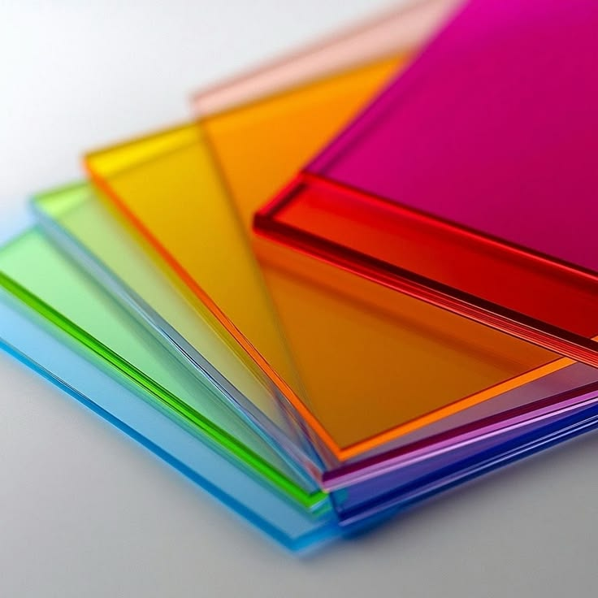

#### Que nos espacio nos interesa: Dentro de lo que es un fanzine y lo que yo puedo entender. me interesa su formate flexible que tiene y los muchos usos que se le pueden dar. En mi caso como lo comente antes y en la visita, lo utilizaria para realizar regalos amorosos.

#### Trabajo a realizar: Para este trabajo lo hare individualmente por lo tanto mi acompañante elegido fue mi pareja. Aun sigo desarrollando el concepto o trabajo pero tengo unas ideas que dandole tiempon puden formar algo. Manejando datos de mi pareja la idea vaga es utilizar su manera de trabajar cuando estuvo en la universidad, Ya que trabajaba respecto a la muerte y la tarxidermia. utilizar datos respectivos para crear alguna visualizacion o alguna obra. Aun sigue en proceso pero las ideas fluyen dispersas. 

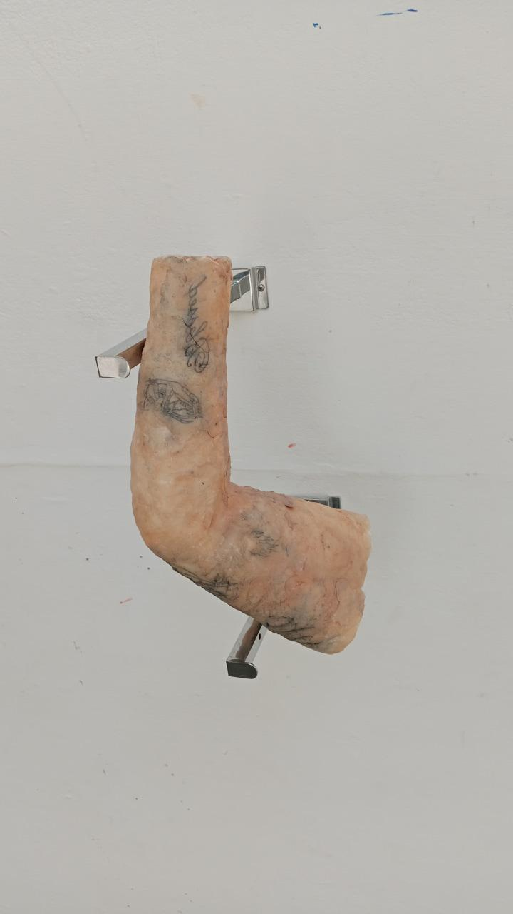
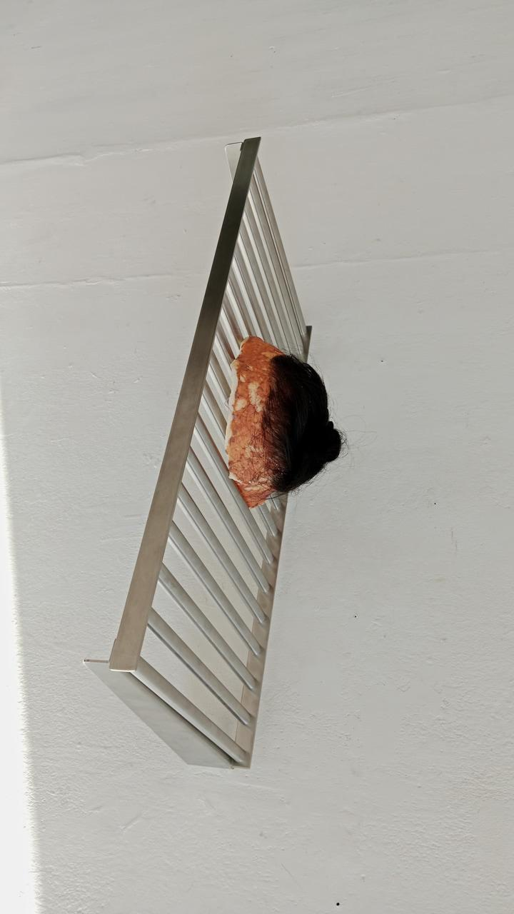
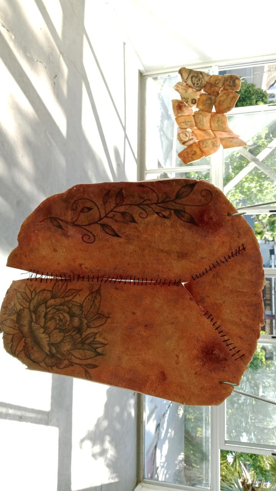

#### Fanzine de regalo: Para el fanzine que se regalara a las integrantes de HambreHambreHambre estaba pensando en alguna interpretacion o poemas seleccionados para pasarlos al material que aun sigo eliguiendo. Ya que tengo ideas de utilizar placas de metal, tipos de papel, vidrio y piel falsa. Todo aun sigue en proceso igual pero ya la idea esta algo formada. 