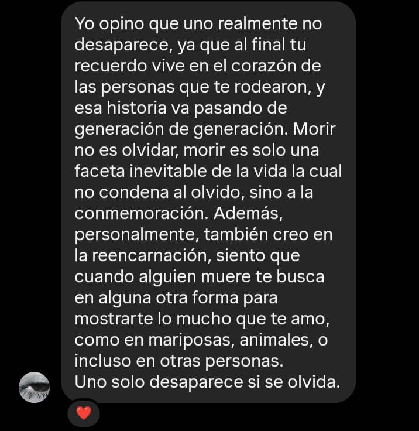
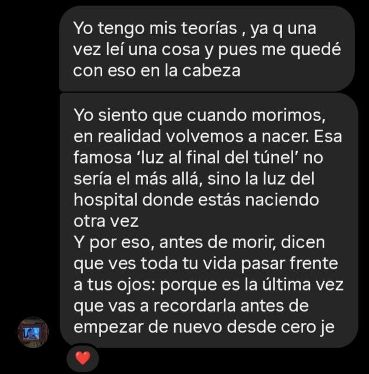
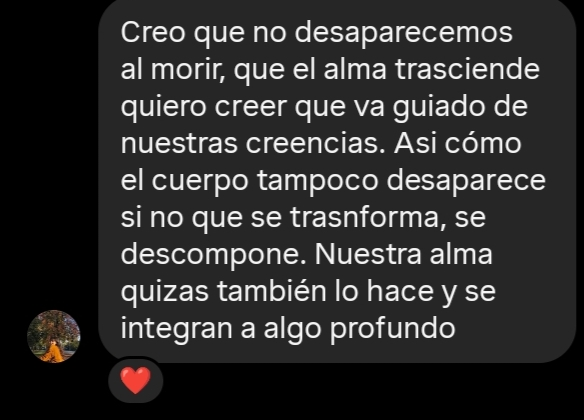
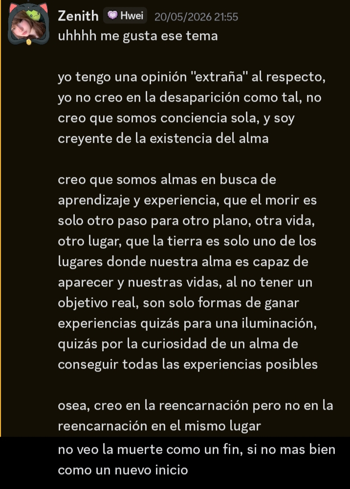

# Anteproyecto.

Este trabajo sera creado como un fanzine. Este estara creado con la documentacion de hielos con unas letras de la cancion de Violeta Parra (Gracias a la vida). Tomando por una parte mi investigacion sobre la muerte (El desvanecimiento del alma). Por el otro lado usando la manera que Violeta Parra tiene al escribir y cantar la cancion. Para esto investige con personas para ver como piensan sobre el desvanecimiento del alma respecto a la muerte.

### Datos. 

La gran mayoria de las personas entrevistadas me hacian llegar al mismo punto final que es la reencarnacion para ellos, aunque algunos tomaban un camino mas distinto por temas de religion y otros fuera de la religion todo concluia para ellos en la reencarnacion. Que el desvanecimiento del alma para ellos no era "visible" ante la muerte, si no al contrario que era un flujo constante de vida el cual cada ve que termina se vuelve a empezar pero con otro cuerpo y para ellos lo que se suele hablar de la luz al final del tunes es un breve viaje de recuerdos de la vida que pasaste y luego de llegar a la luz comienza tu nueva vida dejando todo atras y asi su olvido. 

## Fotografias

### Trabajo. 

El trabajo consiste en documentar el tiempo del hielo con palabras formando texto hechos de con letras de la cancion de violeta parra. Sacando foto de fragmento en donde el hielo esta nuevo y comience a derretirse con las palabras encima (Una letra para cada hielo). Todo esto para contradecir el desarrollo de la obra que se basa en el desvanecimiento de la letra y hielo para mantenerlo vivo dentro del Fanzine. 

## Documentación boceto

