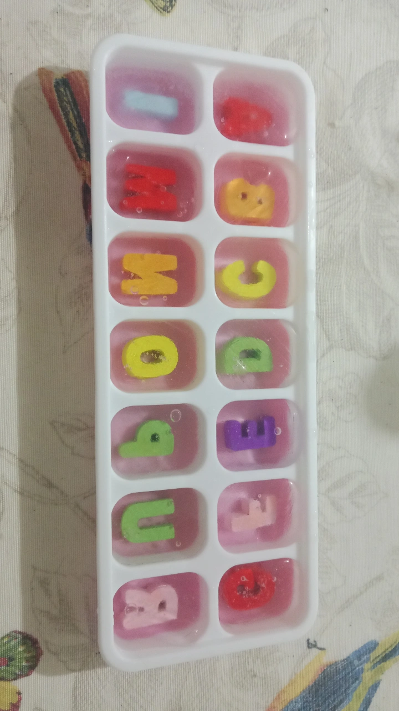

## Pruebas Letra hielo

Intente crear los moldes como se habia hablado en la reunion con el MVP pero no resulto como queria. Las letras se me pegaron al hielo y es un horror sacarlos. Aunque me gusta como se ve con las letras de colores es mucho mas costoso de lo que espere pero lo bueno que tengo un posible remplaso para hacer lo del letrado en mi Fanzine. 

## Boceto de composicion del Fanzine

