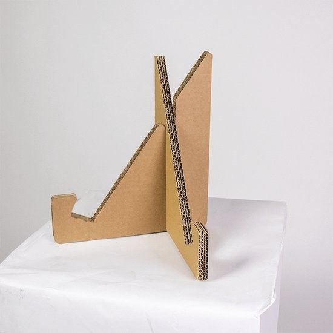
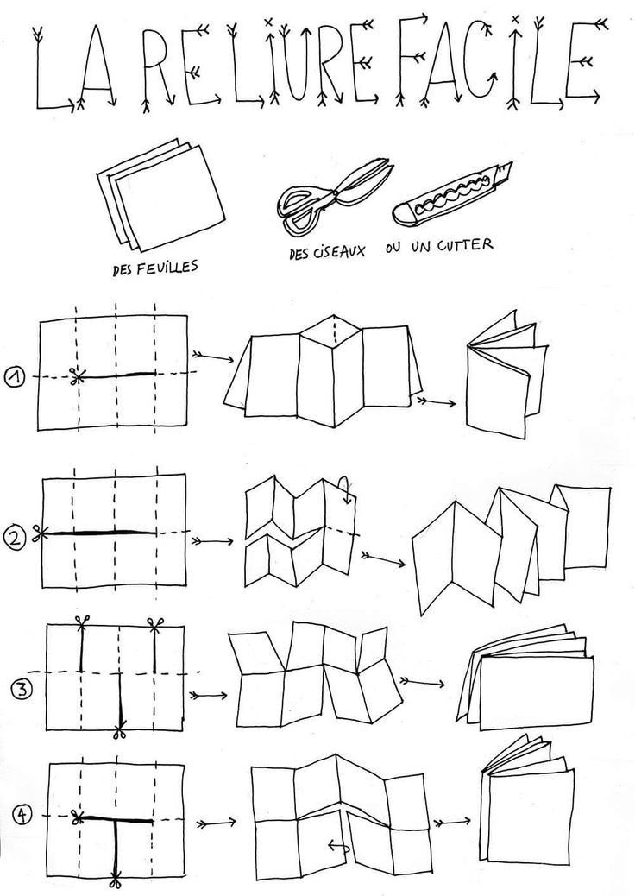

# Título obra: Conservar la pérdida

## Integrante: Manuel Alexis Fierro Valdes

## Statement de la obra: 
Esta obra documenta el derretimiento de bloques de hielo intervenidos con letras de la canción Gracias a la vida de Violeta Parra. La propuesta surge de una investigación sobre el desvanecimiento del alma y las distintas percepciones de la muerte, entendida no como un final absoluto, sino como un proceso de transformación.

A medida que el hielo se derrite, las palabras dejan de existir como texto legible. Sin embargo, las letras, construidas en goma eva, permanecen en el espacio luego de que el soporte desaparece. Mediante el registro fotográfico y su recopilación en un fanzine, la obra reflexiona sobre la relación entre permanencia y cambio, donde aquello que pierde su forma original continúa existiendo bajo una nueva condición.

## Imagen de referencia del trabajo

- imagen referente del diseño mejor 

 

